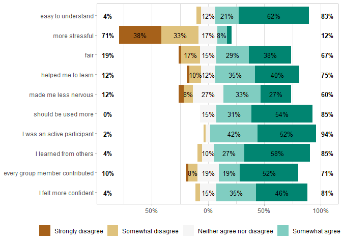
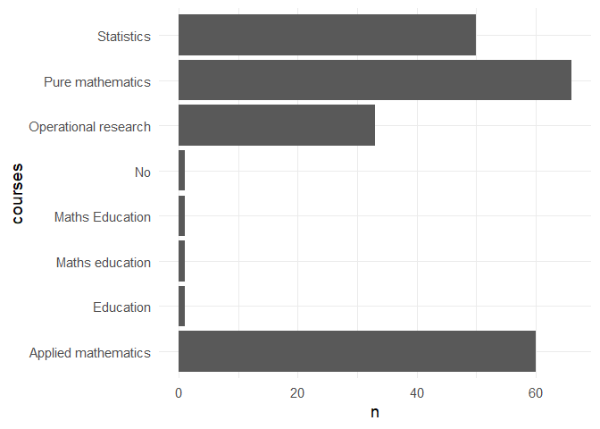
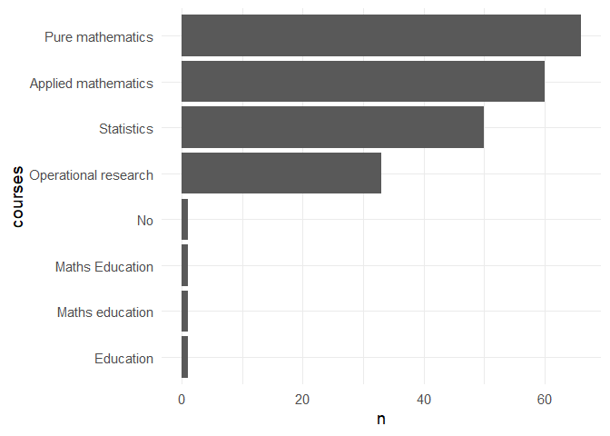
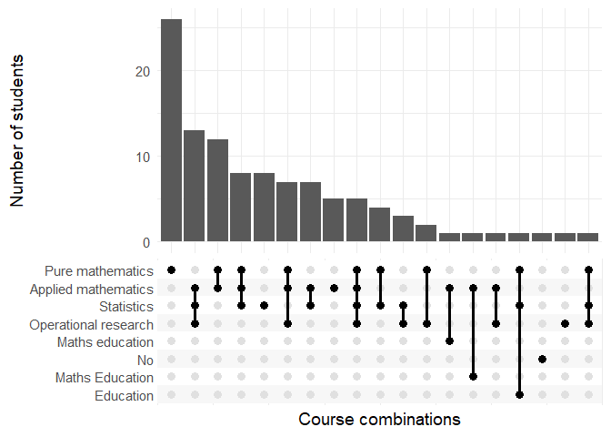
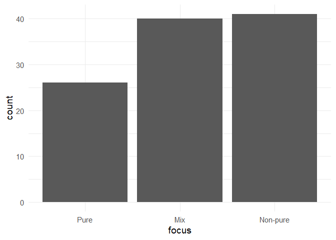
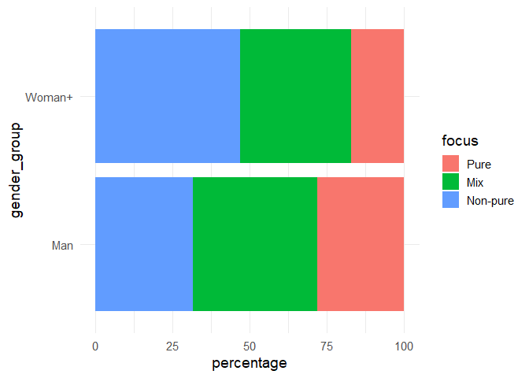
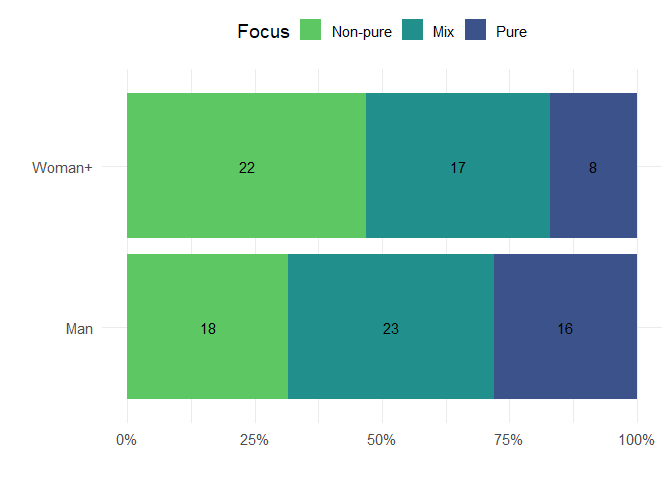

Quantitative survey analysis
================
George Kinnear
2025-03-19

Useful resources for working with R:

- Nordmann, E., McAleer, P., Toivo, W., Paterson, H. & DeBruine, L.
  (2022). Data visualisation using R, for researchers who don’t use R.
  Advances in Methods and Practices in Psychological Science.
  <https://doi.org/10.1177/25152459221074654>

- R for Data Science (2e) <https://r4ds.hadley.nz/>

# Example: two-stage exams

``` r
survey_data_raw <- read_csv("twostage_study1_survey.csv", show_col_types = FALSE)

survey_data_clean <- survey_data_raw %>% 
  separate_wider_position(Process, widths = c("Q1" = 1, "Q2" = 1, "Q3" = 1, "Q4" = 1, "Q5" = 1, "Q6" = 1)) %>% 
  separate_wider_position(Discussion, widths = c("Q7" = 1, "Q8" = 1, "Q9" = 1, "Q10" = 1)) %>% 
  filter(!is.na(Q1))

survey_data_clean
```

    ## # A tibble: 48 × 11
    ##    AnonID Q1    Q2    Q3    Q4    Q5    Q6    Q7    Q8    Q9    Q10  
    ##    <chr>  <chr> <chr> <chr> <chr> <chr> <chr> <chr> <chr> <chr> <chr>
    ##  1 S21    1     5     1     5     5     3     1     4     3     4    
    ##  2 S16    1     1     1     1     1     1     1     1     1     1    
    ##  3 S26    2     5     2     1     3     2     1     1     1     1    
    ##  4 S22    1     4     2     2     3     3     2     1     1     2    
    ##  5 S11    1     5     1     1     3     2     2     2     1     2    
    ##  6 S17    1     5     1     2     1     1     1     1     1     1    
    ##  7 S23    1     5     3     1     1     1     1     1     1     1    
    ##  8 S6     2     3     2     2     3     1     2     1     1     2    
    ##  9 S27    1     5     1     2     1     1     1     1     1     1    
    ## 10 S24    1     2     2     3     3     2     1     1     2     2    
    ## # ℹ 38 more rows

``` r
choice_levels <- c(
  "Strongly disagree",
  "Somewhat disagree",
  "Neither agree nor disagree",
  "Somewhat agree",
  "Strongly agree"
)

item_texts <- tibble(
  item = paste0("Q", c(1:10)),
  text = c(
    "easy to understand",
    "more stressful",
    "fair",
    "helped me to learn",
    "made me less nervous",
    "should be used more",
    "I was an active participant",
    "I learned from others",
    "every group member contributed",
    "I felt more confident"
  )
) %>% pivot_wider(names_from = item, values_from = text) %>%
  as.list()

ggstats::gglikert(
  data = survey_data_clean %>%
    select(-AnonID) %>% 
    # put the choices in the correct order!
    mutate(across(c(Q1:Q10), ~ factor(
      .x,
      levels = c(5:1), # make this c(1:5) if the choices are in the other direction
      labels = choice_levels
    ))), 
  variable_labels = item_texts
)
```

<!-- -->

# Example: course choices

``` r
survey_responses <- read_csv("ANON_course-choices-and-gender.csv", show_col_types = FALSE)
survey_responses
```

    ## # A tibble: 107 × 3
    ##    student gender_group courses                                                 
    ##      <dbl> <chr>        <chr>                                                   
    ##  1       1 Man          Statistics;                                             
    ##  2       2 Woman+       Statistics;                                             
    ##  3       3 Woman+       Applied mathematics;                                    
    ##  4       4 Woman+       Pure mathematics;                                       
    ##  5       5 Woman+       Pure mathematics;Statistics;                            
    ##  6       6 Woman+       Statistics;Applied mathematics;Operational research;    
    ##  7       7 Man          Pure mathematics;Applied mathematics;Operational resear…
    ##  8       8 Man          Statistics;Applied mathematics;Pure mathematics;        
    ##  9       9 <NA>         Pure mathematics;                                       
    ## 10      10 Man          Statistics;Applied mathematics;                         
    ## # ℹ 97 more rows

``` r
course_types_long <- survey_responses %>% 
  separate_longer_delim(cols = courses, delim = ";") %>% 
  filter(courses != "")
course_types_long
```

    ## # A tibble: 213 × 3
    ##    student gender_group courses             
    ##      <dbl> <chr>        <chr>               
    ##  1       1 Man          Statistics          
    ##  2       2 Woman+       Statistics          
    ##  3       3 Woman+       Applied mathematics 
    ##  4       4 Woman+       Pure mathematics    
    ##  5       5 Woman+       Pure mathematics    
    ##  6       5 Woman+       Statistics          
    ##  7       6 Woman+       Statistics          
    ##  8       6 Woman+       Applied mathematics 
    ##  9       6 Woman+       Operational research
    ## 10       7 Man          Pure mathematics    
    ## # ℹ 203 more rows

Number of students picking each option:

``` r
course_types_long %>% 
  count(courses)
```

    ## # A tibble: 8 × 2
    ##   courses                  n
    ##   <chr>                <int>
    ## 1 Applied mathematics     60
    ## 2 Education                1
    ## 3 Maths Education          1
    ## 4 Maths education          1
    ## 5 No                       1
    ## 6 Operational research    33
    ## 7 Pure mathematics        66
    ## 8 Statistics              50

As a bar graph:

``` r
course_types_long %>% 
  count(courses) %>% 
  ggplot(aes(x = courses, y = n)) +
  geom_bar(stat = "identity") +
  coord_flip()
```

<!-- -->

Reorder the bars from biggest to smallest:

``` r
course_types_long %>% 
  count(courses) %>% 
  mutate(courses = fct_reorder(courses, n)) %>% 
  ggplot(aes(x = courses, y = n)) +
  geom_bar(stat = "identity") +
  coord_flip()
```

<!-- -->

Use `ggupset` to look at combinations:

``` r
course_types_long %>% 
  summarise(courses = list(courses), .by = student) %>% 
  ggplot(aes(x = courses)) +
    geom_bar() +
    ggupset::scale_x_upset() +
    labs(x = "Course combinations", y = "Number of students")
```

<!-- -->

Summarise the overall “focus” for each student:

``` r
curricular_focus <- survey_responses %>% 
  mutate(focus = case_when(
    courses == "Pure mathematics;" ~ "Pure",
    str_detect(courses, "Pure") ~ "Mix",
    .default = "Non-pure"
  ) %>%
  fct_relevel("Pure", "Mix", "Non-pure"))

curricular_focus %>% 
  ggplot(aes(x = focus)) +
  geom_bar()
```

<!-- -->

Split the data by gender:

``` r
curricular_focus_by_gender <- curricular_focus %>% 
  filter(!is.na(gender_group)) %>% 
  count(gender_group, focus) %>% 
  mutate(percentage = n / sum(n) * 100, .by = gender_group) 

curricular_focus_by_gender %>% 
  ggplot(aes(x = gender_group, y = percentage, fill = focus)) +
  geom_bar(stat = "identity") +
  coord_flip()
```

<!-- -->

Tweak the plot to make it clearer:

``` r
curricular_focus_by_gender %>% 
  mutate(label_pos = 1 - (cumsum(percentage/100) - (0.5 * percentage/100)), .by = gender_group) %>% 
  ggplot(aes(x = gender_group, y = percentage/100, fill = focus)) +
  geom_bar(stat = "identity") +
  geom_text(aes(label = n, y = label_pos)) +
  coord_flip() +
  scale_y_continuous(labels = scales::percent) +
  scale_fill_viridis_d("Focus", option = "viridis", begin = 0.25, end = 0.75, guide = guide_legend(reverse = TRUE)) +
  labs(x = "", y = "") +
  theme(legend.position = "top")
```

<!-- -->
